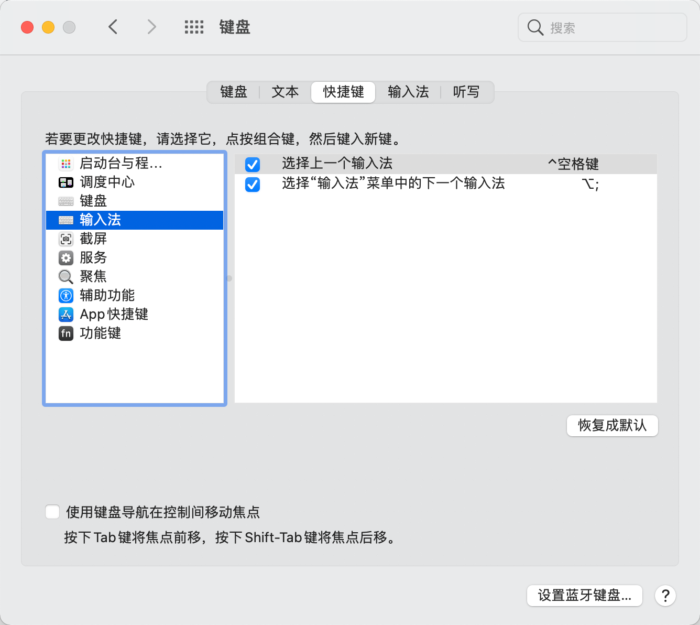
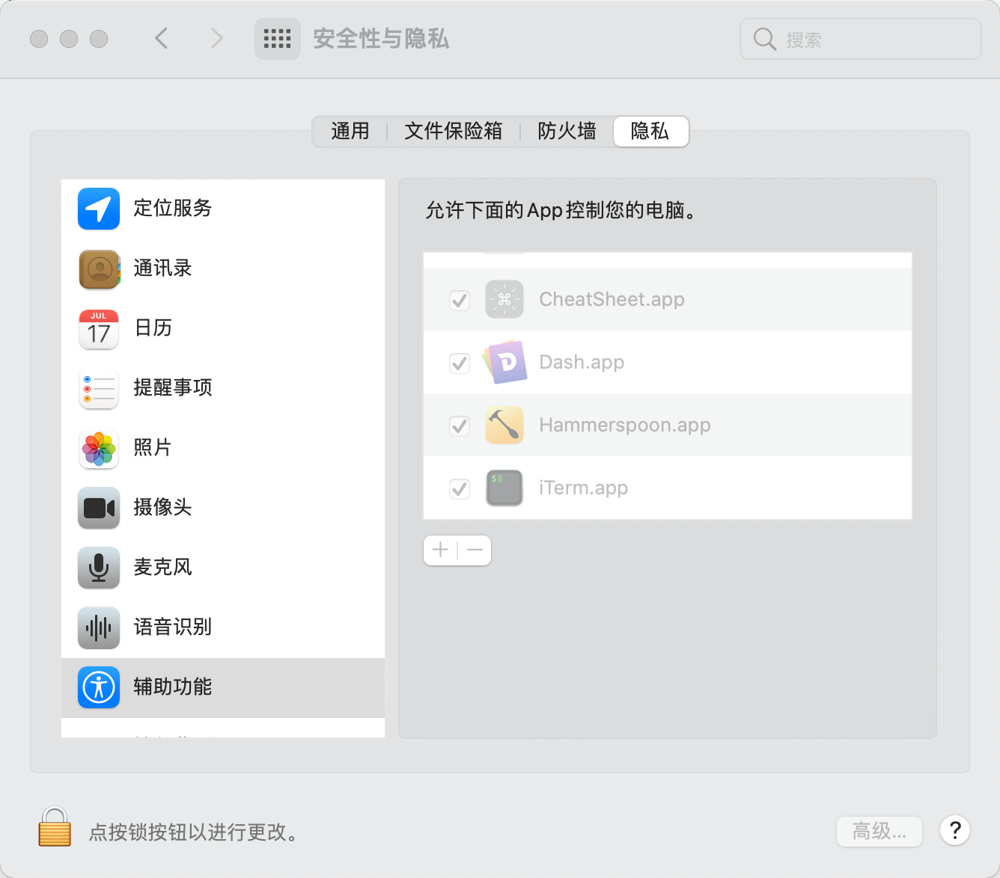

# macos-autoim.vim
macos自动切换输入法

在进入normal模式时，如果当前输入法是中文输入法，则保存输入状态，然后切换到英文输入法。
在进入insert模式时，如果保存的输入状态为中文，切到中文输入法。

**如果在insert模式下为中文，直接退出到normal的切换，可能会一点慢**

# 安装
1. 安装插件
```viml
Plug 'tenfyzhong/macos-autoim.vim'
```

2. 设置切换到上一个输入法的快捷键为`ctrl-space`

3. 在安全性与隐私-辅助功能上添加终端程序

